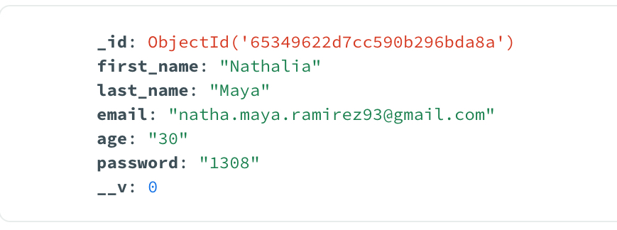
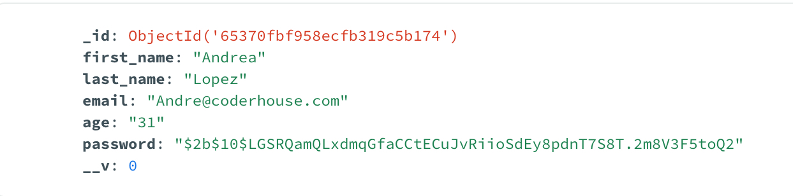

## 🔐 AUTENTICACION 

- Aplicar el hash en las contraseñas y email para que no aparezcan en los datos de la base de datos. 




### 🛠️ Implementación de Bcrypt


1. Instalar la dependencia Brypt

```shell
npm i bcrypt
```

2.  En el archivo utils.js de nuestro proyecto se debe import el bcrypt y generar los métodos para hashear el password. 

```shell
import bcrypt, { genSaltSync } from "bcrypt";

// Crear el hash para que el registro guarde la contraseña hasheada.
export const createHash = (password) =>
  bcrypt.hashSync(password, genSaltSync(10));

// Verificar el hash
export const isValidPassword = (user, password) =>
  bcrypt.compareSync(password, user.password);


```

### 🔑  Métodos de la dependencia

* **genSaltSync(10)** genera una "sal" (salt) aleatoria que se utiliza para mejorar la seguridad del hash. La sal es un valor aleatorio único que se concatena con la contraseña antes de realizar el hash. Esto garantiza que aunque dos usuarios tengan la misma contraseña, sus hashes serán diferentes debido a las sales únicas.

* **bcrypt.hashSync** es una función de Bcrypt que toma la contraseña y la sal, y genera un hash de la contraseña. El número 10 en genSaltSync(10) representa el costo del algoritmo de hash (cuántas rondas de hash se realizan internamente). Un costo más alto implica que el proceso de hash será más lento, lo que hace que sea más difícil para los atacantes realizar ataques de fuerza bruta.

### ✅ Resultado password con hash

